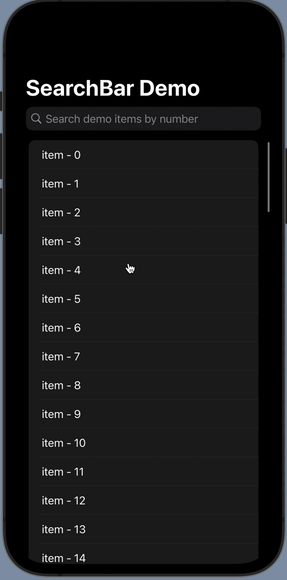

# SwiftUISearchBar

SwiftUI search bar as system style

## Usage



```swift
@State var searchText: String = ""

.embedInNavigationBar($searchText,
    placeholder: "Search bar placeholder string",
    showOnAppear: true,
    hideWhenScrolling: false)
```

## Reference

* [Refer to this article and thank the author **Geri Borbás**](http://blog.eppz.eu/swiftui-search-bar-in-the-navigation-bar/)